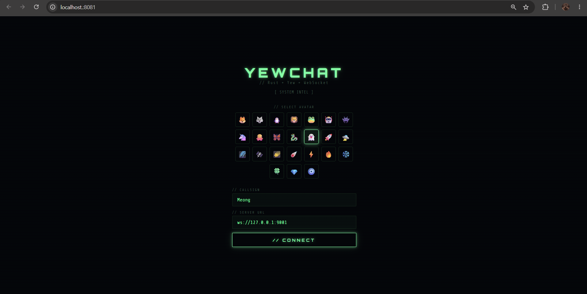
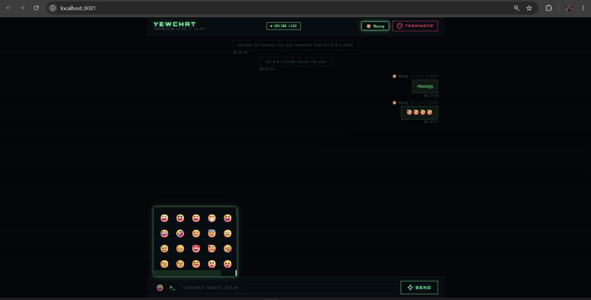
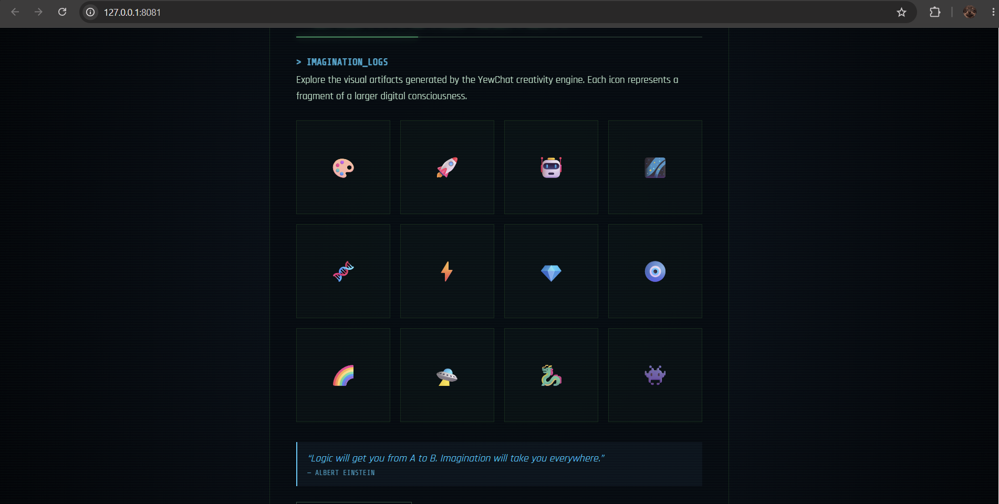

### Experiment 3.1: Original code

NOTE: Karena source code yang digunakan sudah tidak kompatible dengan versi rust sekarang, saya membuat sendiri code klien dan servernya.

### Experiment 3.2: Be Creative!

Untuk mewujudkan pembaruan kreatif dan penambahan fitur tersebut, saya melakukan modifikasi komprehensif yang berpusat pada dua berkas utama di sisi klien, yaitu index.html dan  
src/lib.rs. Pada berkas index.html, saya menyisipkan skrip pustaka ikon Lucide via CDN dan merombak blok CSS secara signifikan dengan menambahkan animasi flicker neon pada judul
utama, efek garis pemindai bergaya terminal retro, serta mendefinisikan tata letak (layout) khusus untuk halaman Gallery dan panel Emoji Picker agar dapat melayang (floating)    
dengan efek pijaran (glow) yang konsisten. Sementara itu, pada berkas logika inti src/lib.rs, perubahannya jauh lebih mendalam; saya memperbarui enum Screen untuk mendaftarkan   
rute halaman Galeri dan menambahkan enum pesan (Msg) baru seperti ToggleEmojiPicker dan AddEmoji untuk menangani interaksi. Di dalam struct App, saya menambahkan state
emoji_picker_open guna mengontrol visibilitas panel, memperluas daftar konstanta AVATARS, serta menciptakan konstanta EMOJIS baru yang memuat ratusan karakter emoji. Saya        
kemudian menyusun fungsi view_gallery dari awal untuk menampilkan koleksi ikon artistik, sekaligus memodifikasi fungsi view_login, view_about, dan view_chat untuk menanamkan     
antarmuka ikon Lucide, mengubah gaya bahasa antarmuka menjadi tema cyberpunk (seperti "transmit neural pulse"), dan memasang tombol toggle emoji beserta struktur panelnya di area
masukan pesan. Sebagai penyempurna, saya mengimplementasikan fungsi lifecycle rendered untuk mengeksekusi skrip JavaScript yang menggambar ikon Lucide ke dalam DOM secara        
dinamis, serta memperbarui logika fungsi update agar setiap emoji yang dipilih langsung dirangkai ke dalam teks masukan dan panel emoji otomatis menutup seketika setelah pesan   
berhasil ditransmisikan.
