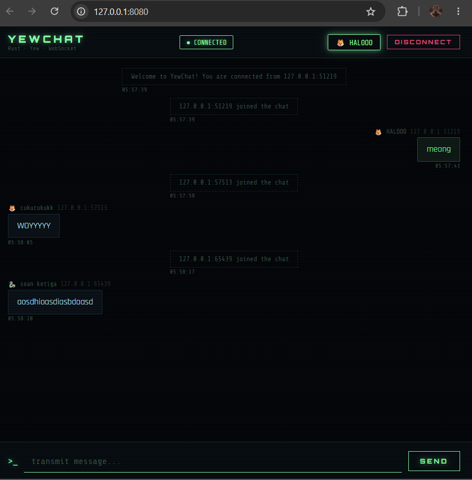

### Experiment 3.1: Original code

### Experiment 3.2: Be Creative!

For this experiment, I've enhanced the YewChat client with a **Cyberpunk "System Intel" Dashboard**. 

#### Creative Enhancements:
- **New Page: [ SYSTEM INTEL ]**: Added a dedicated information page with a terminal-like aesthetic, providing technical specs and project philosophy.
- **Enhanced Visuals**: 
    - Implemented a **Scanline Effect** overlay across the entire application.
    - Added a **Dynamic Laser Scan** animation on the About page.
    - Expanded the **Avatar Matrix** with space-themed and elemental emojis.
- **Interactive UI**:
    - Cyber-styled buttons with glow effects and hover states.
    - Integrated "Glitch" lines for section separation.
- **Creative Narratives**: 
    - Reframed technical details as "Architecture Core".
    - Added a "Creativity Protocol" section inspired by the World Economic Forum's insights on the future workforce.
    - Used hacker-style nomenclature (e.g., "Callsings", "Uplink", "Transmit").

#### Screenshots:
1. **Login Matrix (New Avatars & Link)**
   

2. **System Intel Dashboard**
   

3. **Live Uplink (Chat Screen)**
   

#### Creative Philosophy:
"In a world driven by automation, creativity is the ultimate encryption." This project attempts to bridge the gap between pure logic (Rust/WASM) and artistic expression, creating an immersive experience that feels like a piece of speculative fiction software.